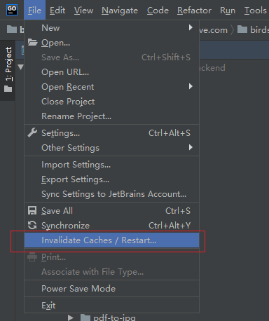

# goland无法识别导入包、跳转不正常问题

### 解决无法识别导入包

- 1、检查是否开启go mod
- 2、若开启了go mod，IDE的setting是否配置正确，需要删除gopath
- 3、go mod tidy
- 4、重新go build即可

### 解决调整不正常

- 1、可尝试删除.idea文件

- 2、删除IDE缓存

- 3、也可参考https://stackoverflow.com/questions/37282285/intellij-cannot-find-any-declarations

  